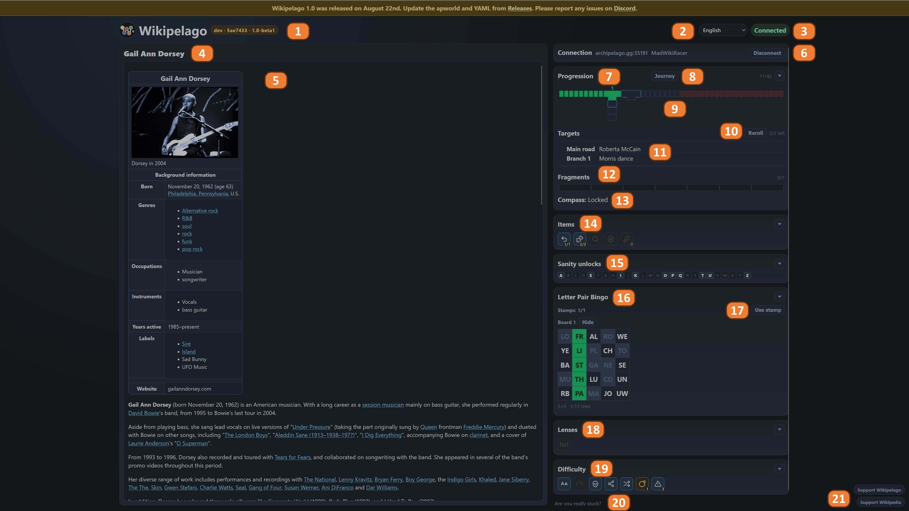

# Web client UI

Play at https://wikipelago.dreskn.fr/. The page is the Wikipedia article on the left and the HUD cards on the right.

Optional cards (Sanity, Bingo, Lenses, Difficulty) only appear when your seed uses those options.

## Legend

1. **current build**
2. **UI language** — for menus, practice and toasts only; the Wikipedia edition comes from your YAML.
3. **Connected / Offline / Practice**
4. **current page**
5. **Wikipedia content**
6. **room login** — server, slot, and password.
7. **Progression panel** — main game tracker.
8. **Journey** — A path of pages you have visited this seed.
9. **progress bar** — each segment is a round. Green segments are checked rounds, highlighted segment is the current round, red segments are locked behind round unlocks. T-shaped segments are crossroads, which start a branch path.
10. **Reroll** — Changes every target at once (main path + branches).
11. **Targets** — The pages you need to reach.
12. **Fragments** — Your progress towards unlocking your seed Grand Goal. Once enough Knowledge Fragments are obtained, your final destination will be known.
13. **Compass** — Alerts you if you're less than two clicks away from your target.
14. **Items** — Main game items, grey when locked. In order: Back button, Rerolls, Search (CTRL-F), Compass, Branch Keys.
15. **Sanities** — Panel for searchsanity (CTRL-F can only uses unlocked letters) or Scrollsanity.
16. **Bingo** — letter-pair bingo boards, stamp a cell by visiting a page starting with that letter pair. Send checks by stamping a full line (row/column/diagonal), plus the full board.
17. **Use stamp** — Use a bonus stamp to cross a letter pair without visiting that page. Get rid of that nasty QZ pair!
18. **Lenses** — If option to hide certain page parts (tables, images, infobox, and so on), lenses are required to restore them.
19. **Difficulty** — When enabled, shows status of deathlink, traps and traplink.
20. **path solver** — external wiki-path helper.
21. **donate links** — Support Wikipelago and Support Wikipedia.

For more info about how rounds, items, and the Grand Goal work, see the [Overview](overview.md). For YAML flags that show or hide these cards, see [Options](options.md).
